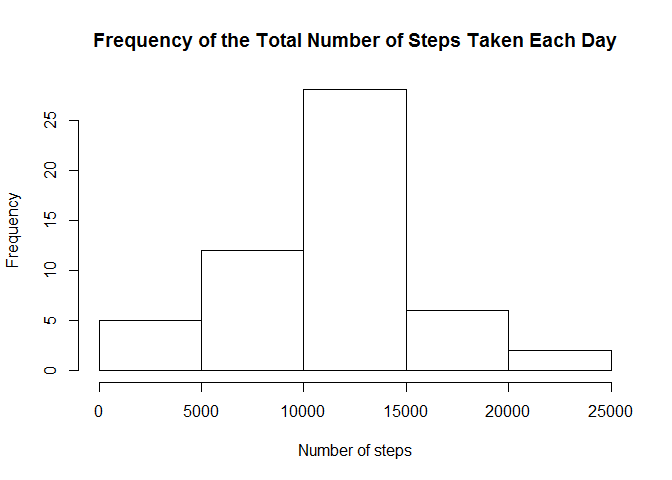
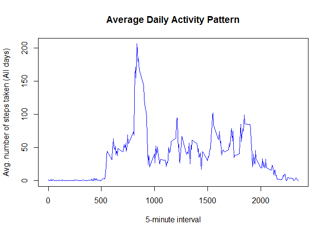
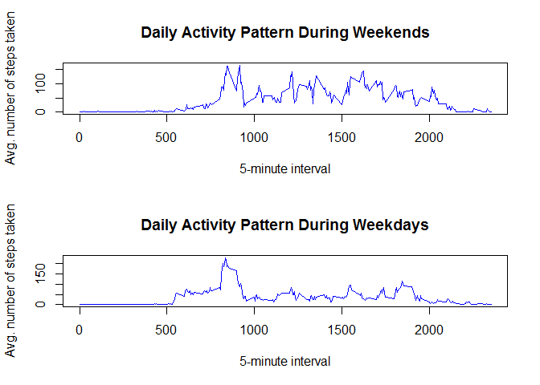

# Reproducible Research: Peer Assessment 1


## Loading and preprocessing the data


```r
csv <- "activity.csv"
data<-read.csv(csv, header = TRUE, sep = ",")
```

## What is mean total number of steps taken per day?

```r
newdata <- data[complete.cases(data$steps),]
answer<-tapply(newdata$steps,newdata$date,sum)
hist(answer,main="Frequency of the Total Number of Steps Taken Each Day",xlab = "Number of steps")
```

<!-- -->

### Mean and median on revised dataset

```r
mean(answer,na.rm=TRUE)
```

```
## [1] 10766.19
```

```r
median(answer,na.rm=TRUE)
```

```
## [1] 10765
```

## What is the average daily activity pattern?
### Time series plot on average daily activity pattern

```r
b<-tapply(newdata$steps,newdata$interval,mean)
c<-unique(newdata[,3])
plot(c,b,col = "blue",type = "l",main = "Average Daily Activity Pattern", 
     xlab = "5-minute interval", ylab = "Avg. number of steps taken (All days)")
```

<!-- -->

### Time interval that yields on average the highest number of steps 

```r
interval.df<-data.frame(cbind(b,c))
max.df<-interval.df[interval.df$b==max(interval.df$b),]
max.df$c
```

```
## [1] 835
```

## Imputing missing values
### Calculate the number of NA's in the original dataset

```r
nadata <- data[is.na(data$steps),]
nrow(nadata)
```

```
## [1] 2304
```

### Setting the value of NAs equal to the mean for that 5-minute interval

```r
nudata <- data
nudata$steps[is.na(nudata$steps)] <- b
```

### Recreate histogram showing the frequency of the total number of steps taken each day

```r
d<-tapply(nudata$steps,nudata$date,sum)
hist(d,main="Total number of steps taken each day",xlab = "Number of steps")
```

<!-- -->

### Recalculate the mean and median. 

```r
mean(d)
```

```
## [1] 10766.19
```

```r
median(d)
```

```
## [1] 10766.19
```

####Notice that the mean remain the same and the median value remain relatively consistent with the value calculated earlier. While imputing missing values with the mean has very little impact on the mean and median of the new dataset, however the frequency has increased for the total number of steps taken each day.

## Are there differences in activity patterns between weekdays and weekends?

```r
nudata$date <- as.Date(nudata$date, format = "%Y-%m-%d")
nudata$weekdays <- weekdays(nudata$date)

weekend_data<- nudata[nudata$weekdays=="Saturday" | nudata$weekdays=="Sunday",]
e<-tapply(weekend_data$steps,weekend_data$interval,mean)

weekday_data<- nudata[nudata$weekdays!="Saturday" & nudata$weekdays!="Sunday",]
f<-tapply(weekday_data$steps,weekday_data$interval,mean)

par (mfrow = c(2,1))
plot(c,e,col = "blue",type = "l",main = "Daily Activity Pattern During Weekends", 
     xlab = "5-minute interval", ylab = "Avg. number of steps taken")
plot(c,f,col = "blue",type = "l",main = "Daily Activity Pattern During Weekdays", 
     xlab = "5-minute interval", ylab = "Avg. number of steps taken")
```

<!-- -->
